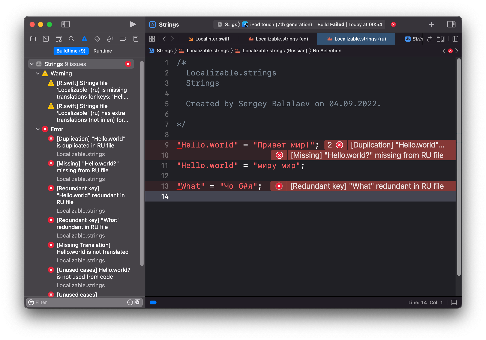
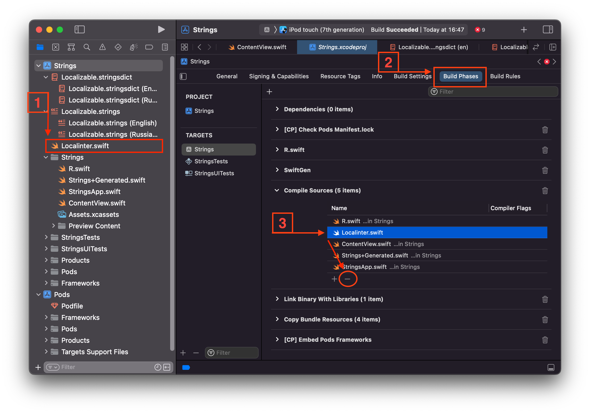

# Localinter

Check localizable files for Swift

## Script allows

 1. Checking the localizable file from masterLanguageCode and find missing keys in other localizable files
 2. Searching potentially untranslated keys from localizable files
 3. Checking duplicate keys from localizable files
 4. Checking unused keys from localizable files



## Accessibility

1. Support .strings, .stringsdict and new .xcstrings formats
2. Support any use notation: classic, l10n, localized, SwiftGen, SwiftUI, and custom Regex
3. You can ignore system keys
4. Any settings for generation errors or warnings

## Install

1. Just copy Localinter.swift to project.
2. Exclude from "Build Phases" -> "Compile Sources"
3. Add to "Build Phases" run script:
```bash
${SRCROOT}/Localinter.swift
```


## Setup:

```swift
/// It language will come as general and ideal
let masterLanguageCode = "en"

/// Path of folder with localizations files. For example "/YouProject/Resources/Languages"
let relativeLocalizablePath = "/YourProject/Resources/Strings"

/// Path of the source folder which will used in searching for localization keys you actually use in your project. For Example "/YouProject/Source"
let relativeSourcePath = "/YourProject"

/// yuo can use many types
let usingTypes: [UsingType] = [
    .swiftGen(enumName: "Strings")
]

/**
 If you want to exclude unused keys from checking, yuo can define they this

 Example:
  let ignoredUnusedKeys = [
     "CFBundleDisplayName",
     "NSCameraUsageDescription"
  ]
 */
let ignoredUnusedKeys: Set<String> = [
    "CFBundleDisplayName",
    "NSCameraUsageDescription"
]

/// If you want to exclude untranslated keys from checking, you can define they this
let ignoredUntranslatedKeys: Set<String> = [
]

let isThrowingErrorForUntranslated = true
let isThrowingErrorForUnused = true
let isClearWhitespasesInLocalizableFiles = false
let isOnlyOneLanguage = false
/// Cleaning localizable files. Will remove comments, empty lines and order your keys by alphabetical.
let isCleaningFiles = false
```
